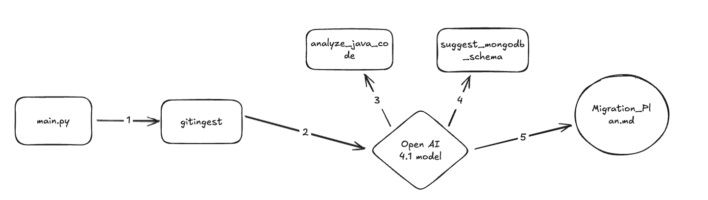
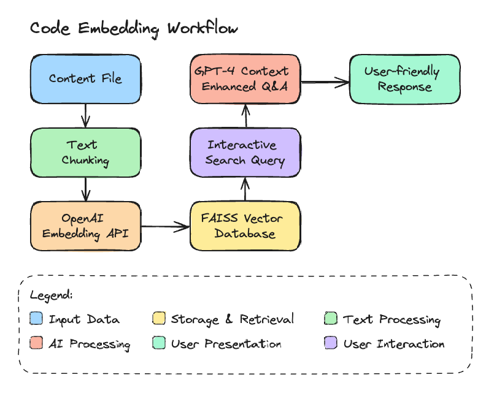

# Migration tool 

## Objective
- I have given [Kitchensink](https://github.com/jboss-developer/jboss-eap-quickstarts/tree/8.0.x/kitchensink) project which has been built using JBoss application available in the Red Hat JBoss EAP.
- My task is to build a generic purpose tool that analyses a java application and creates a migration plan to make the code work with MongoDB.. 
- The tool can use LLM’s to analyse the codebase and build a migration plan
- Stretch goal: The tool can also suggest a schema for MongoDB based on the static code scan. It would be great.

## Technology stack 
- Python `3.11.7`
- Open ai [gpt-4.1](https://openai.com/index/gpt-4-1/)
    - I have used chat completion api to compelte this task. More info you can find [here.](https://platform.openai.com/docs/api-reference/chat/create)
    - On Apr 14 2025 Open ai launched this gpt-4.1 modes which has  `advanced programming capabilities, making it a valuable tool for software development and related tasks.`
- Used [Gitingest](https://github.com/cyclotruc/gitingest) package to convert code repo in to single text file so that easily can give that complete code file as input in to LLM.
    - Assumption I took here: For now to complete this task ans since input code reposiroty was very small so thats why I decided to convert this input repo in to one single text file and gave as input to Open AI LLM for migration. 
    - In future if input code base is getting bigger then I need to look for another option like uploading this code base in to some external data source and then need to make sure LLM can access that code base in real time.

## Steps to set up this project to run on local machine
1. Need to use this below specific pything version to set this up.
```
pyenv local 3.11.7
```
2. Set up virtual environment using below command 
```
python3 -m venv .venv
```
3. Activate virtual environment
```
source .venv/bin/activate
```
4. Install all dependencies from requirement.txt file
```
pip install -r requirements.txt
OR
pip install -r requirements.txt --index-url https://pypi.org/simple
```
5. Make sure you must have Open AI API key set up in .env or as environment variable. 
```
export OPENAI_API_KEY=<PUT YOUR OPEN AI API KEY HERE>
OR
Update Below line in .env file
OPENAI_API_KEY=<PUT-YOUR-OPEN-AI-API-KEY-HERE>
```
6. To run this project
    - Here code folder contains kitchensink project. 
    - Currently in main.py file I have hardcoded source kitchensink project location.
    - At the end when analysis is compelted then putting that in to `Migration_Plan.md` file
    - Below is the command to run this project locally
```
python src/main.py
```

# Migration Tool Overview



## Step 1: Git Ingest

- The `gitingest` module reads the complete KitchenSink input code and generates:
  - A **content file**: Contains the entire codebase merged into a single file.
  - A **tree file**: Captures the directory structure information of the codebase.
- You can find demo versions of these files under `src/code_folder` for reference.

---

## Step 2: Code Analysis and Schema Suggestion

This step involves a two-phase process using the OpenAI model:

1. **Analyze Java Code**
   - The `analyze_java_code` function uses the OpenAI 4.1 model.
   - It builds a prompt with instructions to analyze the input code and generate a migration plan targeting a Spring Boot Java application.

2. **Suggest MongoDB Schema**
   - The `suggest_mongodb_schema` function also uses the OpenAI model.
   - It builds a prompt using the previously generated migration plan to suggest a corresponding MongoDB schema.

---

## Step 3: Generate Final Output

- In the final step, the outputs from both functions are combined.
- The consolidated migration details are written into a file named `Migration_Plan.md`.

---

# Future Enhancement
- If the code repository is big then this approach might not work as I need think about some other alternative to upload this code in to some vector or other DB which LLM can pull run time. 
- I can create kind of chatbot using Streamlit api and can make intereactive chat bot using nice UI design etc.

# Below is the enhancement flow that I have implemented to create kind of like chat bot



# Video demo of enhancement

